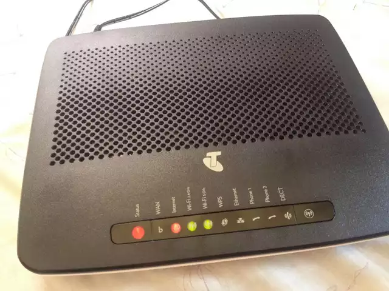

# brcm63xx-tch
Mirror of OpenWRT for brcm63xx-tch firmware. Suitable for Telstra branded Technicolor TG799vac modem/routers.

Point source at:
https://raw.githubusercontent.com/fexofenadine/brcm63xx-tch/master/packages/Packages.gz

For example, edit your /etc/opkg/distfeeds.conf to include the lines:

    src/gz packages https://raw.githubusercontent.com/fexofenadine/brcm63xx-tch/master/packages
    src/gz base https://raw.githubusercontent.com/fexofenadine/brcm63xx-tch/master/base
    
 Then run 
    
    opkg update
    
:)
